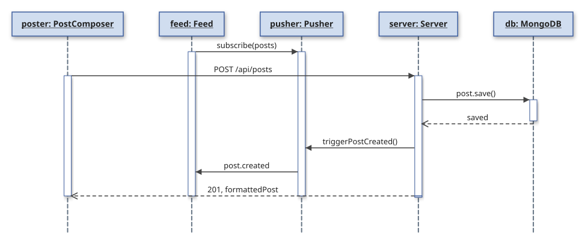

This is a [Next.js](https://nextjs.org) project bootstrapped with [`create-next-app`](https://github.com/vercel/next.js/tree/canary/packages/create-next-app).

## Local Deployment

First, install dependencies:

```bash
npm ci
```

Then setup environment variables for MongoDB, NextAuth, and Pusher as described in the sections below. Environment variables should be in a file titled .env.local

Finally, start the development server:
```bash
npm run dev
```

Open [http://localhost:3000](http://localhost:3000) with your browser to see the result.

## MongoDB Details
First, install dependencies:
```bash
npm install next-auth bcryptjs mongoose
```

Signup for MongoDB account

Step 1: Go to cloud.mongodb.com, click Try Free, sign up with Google or email

Step 2:
Click Create and select M0 Free
Pick AWS as the provider
Set region to us-west-2 (Oregon or anything) closest to LA
Name it whatever
Click Create Deployment

Step 3: Create a database user
Atlas will prompt you immediately after cluster creation:
Username: something simple like bruinpop-admin
Password: click autogenerate and copy it somewhere safe
Click Create Database User

Step 4: When asked where to connect from, click Allow Access from Anywhere
This adds 0.0.0.0/0 — required for Vercel's dynamic IPs
Click Finish and Close

Step 5: Create the database and collection
In the left sidebar click Data Explorer
Click Add My Own Data
Database Name: bruinpop or whatever
Collection Name: users or whatever
Click Create

Step 6: Get your connection string
Go back to your cluster and click Connect
Choose Drivers
Select Node.js and copy the string
Add bruinpop before the ? so it reads:
mongodb+srv://bruinpop-admin:<password>@bruinpop-cluster.xxxxx.mongodb.net/bruinpop?retryWrites=true&w=majority
Replace <password> with the password you saved in Step 3

Step 7: Add to your project
Paste the connection string into .env.local:
MONGODB_URI=mongodb+srv://bruinpop-admin:<password>@bruinpop-cluster.xxxxx.mongodb.net/bruinpop?retryWrites=true&w=majority


## NextAuth Details
Use the following command to set up NEXTAUTH_SECRET.
```bash
npx auth secret
```

```.env
NEXTAUTH_SECRET=
NEXTAUTH_URL=http://localhost:3000
```

## Pusher Details
Create a Pusher account at [pusher.com](https://pusher.com/) and a pusher channels project. Then fill in the following env variables that can be found in the project dashboard under the tab App Keys:

```.env
PUSHER_APP_ID=
PUSHER_KEY=
PUSHER_SECRET=
PUSHER_CLUSTER=

NEXT_PUBLIC_PUSHER_KEY=
NEXT_PUBLIC_PUSHER_CLUSTER=
```

## Diagrams


This diagram depicts the flow of post creation, which mirrors the flow for live-updating post interactions and deletions. The feed subscribes to pusher, which is notified by the server when a post is created to notify the feed, which merges the new post. For the actual post, the poster uses POST /api/posts to send the information to the server, which then queries the database to save the post. The server then notifies the pusher as discussed above.

[NextAuth.drawio](https://github.com/user-attachments/files/28625306/NextAuth.drawio)

<mxfile host="app.diagrams.net">
  <diagram name="Page-1" id="F6m7tUeWuHqFHIfkhLVH">
    <mxGraphModel dx="1245" dy="796" grid="1" gridSize="10" guides="1" tooltips="1" connect="1" arrows="1" fold="1" page="1" pageScale="1" pageWidth="850" pageHeight="1100" math="0" shadow="0">
      <root>
        <mxCell id="0" />
        <mxCell id="1" parent="0" />
        <mxCell id="q7zFSxGViEKdmVw50Rnz-1" parent="1" style="rounded=0;whiteSpace=wrap;html=1;" value="user : User" vertex="1">
          <mxGeometry height="60" width="80" x="20" y="20" as="geometry" />
        </mxCell>
        <mxCell id="q7zFSxGViEKdmVw50Rnz-2" parent="1" style="rounded=0;whiteSpace=wrap;html=1;" value="authPage" vertex="1">
          <mxGeometry height="60" width="80" x="110" y="20" as="geometry" />
        </mxCell>
        <mxCell id="q7zFSxGViEKdmVw50Rnz-3" parent="1" style="rounded=0;whiteSpace=wrap;html=1;" value="nextAuthClient" vertex="1">
          <mxGeometry height="60" width="80" x="200" y="20" as="geometry" />
        </mxCell>
        <mxCell id="q7zFSxGViEKdmVw50Rnz-4" parent="1" style="rounded=0;whiteSpace=wrap;html=1;" value="nextAuthCore" vertex="1">
          <mxGeometry height="60" width="85" x="380" y="20" as="geometry" />
        </mxCell>
        <mxCell id="q7zFSxGViEKdmVw50Rnz-5" parent="1" style="rounded=0;whiteSpace=wrap;html=1;" value="credentialsProvider" vertex="1">
          <mxGeometry height="60" width="110" x="475" y="20" as="geometry" />
        </mxCell>
        <mxCell id="q7zFSxGViEKdmVw50Rnz-6" parent="1" style="rounded=0;whiteSpace=wrap;html=1;" value="mongoDB/User" vertex="1">
          <mxGeometry height="60" width="100" x="595" y="20" as="geometry" />
        </mxCell>
        <mxCell id="q7zFSxGViEKdmVw50Rnz-7" parent="1" style="rounded=0;whiteSpace=wrap;html=1;" value="callbacks" vertex="1">
          <mxGeometry height="60" width="100" x="705" y="20" as="geometry" />
        </mxCell>
        <mxCell id="q7zFSxGViEKdmVw50Rnz-8" parent="1" style="rounded=0;whiteSpace=wrap;html=1;" value="router : NextRouter" vertex="1">
          <mxGeometry height="60" width="100" x="810" y="20" as="geometry" />
        </mxCell>
        <mxCell id="q7zFSxGViEKdmVw50Rnz-9" edge="1" parent="1" source="q7zFSxGViEKdmVw50Rnz-31" style="endArrow=none;dashed=1;html=1;rounded=0;exitX=0.046;exitY=0.995;exitDx=0;exitDy=0;exitPerimeter=0;" value="">
          <mxGeometry height="50" relative="1" width="50" as="geometry">
            <mxPoint x="59.33" y="310" as="sourcePoint" />
            <mxPoint x="59.33" y="80" as="targetPoint" />
          </mxGeometry>
        </mxCell>
        <mxCell id="q7zFSxGViEKdmVw50Rnz-10" edge="1" parent="1" source="q7zFSxGViEKdmVw50Rnz-31" style="endArrow=none;dashed=1;html=1;rounded=0;exitX=0.162;exitY=0.985;exitDx=0;exitDy=0;exitPerimeter=0;" value="">
          <mxGeometry height="50" relative="1" width="50" as="geometry">
            <mxPoint x="149.33" y="310" as="sourcePoint" />
            <mxPoint x="149.33" y="80" as="targetPoint" />
          </mxGeometry>
        </mxCell>
        <mxCell id="q7zFSxGViEKdmVw50Rnz-11" edge="1" parent="1" source="q7zFSxGViEKdmVw50Rnz-31" style="endArrow=none;dashed=1;html=1;rounded=0;exitX=0.272;exitY=1.012;exitDx=0;exitDy=0;exitPerimeter=0;" value="">
          <mxGeometry height="50" relative="1" width="50" as="geometry">
            <mxPoint x="244.33" y="310" as="sourcePoint" />
            <mxPoint x="244.33" y="80" as="targetPoint" />
          </mxGeometry>
        </mxCell>
        <mxCell id="q7zFSxGViEKdmVw50Rnz-12" edge="1" parent="1" style="endArrow=none;dashed=1;html=1;rounded=0;" value="">
          <mxGeometry height="50" relative="1" width="50" as="geometry">
            <mxPoint x="440" y="740" as="sourcePoint" />
            <mxPoint x="421.83" y="80" as="targetPoint" />
          </mxGeometry>
        </mxCell>
        <mxCell id="q7zFSxGViEKdmVw50Rnz-13" edge="1" parent="1" style="endArrow=none;dashed=1;html=1;rounded=0;" value="">
          <mxGeometry height="50" relative="1" width="50" as="geometry">
            <mxPoint x="540" y="740" as="sourcePoint" />
            <mxPoint x="529.3299999999999" y="80" as="targetPoint" />
          </mxGeometry>
        </mxCell>
        <mxCell id="q7zFSxGViEKdmVw50Rnz-14" edge="1" parent="1" source="q7zFSxGViEKdmVw50Rnz-31" style="endArrow=none;dashed=1;html=1;rounded=0;exitX=0.738;exitY=1.015;exitDx=0;exitDy=0;exitPerimeter=0;" value="">
          <mxGeometry height="50" relative="1" width="50" as="geometry">
            <mxPoint x="644" y="750" as="sourcePoint" />
            <mxPoint x="644.33" y="80" as="targetPoint" />
          </mxGeometry>
        </mxCell>
        <mxCell id="q7zFSxGViEKdmVw50Rnz-15" edge="1" parent="1" style="endArrow=none;dashed=1;html=1;rounded=0;" value="">
          <mxGeometry height="50" relative="1" width="50" as="geometry">
            <mxPoint x="754" y="740" as="sourcePoint" />
            <mxPoint x="754.33" y="80" as="targetPoint" />
          </mxGeometry>
        </mxCell>
        <mxCell id="q7zFSxGViEKdmVw50Rnz-16" edge="1" parent="1" style="endArrow=none;dashed=1;html=1;rounded=0;" value="">
          <mxGeometry height="50" relative="1" width="50" as="geometry">
            <mxPoint x="864.33" y="310" as="sourcePoint" />
            <mxPoint x="864.33" y="80" as="targetPoint" />
          </mxGeometry>
        </mxCell>
        <mxCell id="q7zFSxGViEKdmVw50Rnz-17" edge="1" parent="1" style="endArrow=none;dashed=1;html=1;dashPattern=1 3;strokeWidth=2;rounded=0;" value="">
          <mxGeometry height="50" relative="1" width="50" as="geometry">
            <mxPoint x="20" y="310" as="sourcePoint" />
            <mxPoint x="820" y="310" as="targetPoint" />
          </mxGeometry>
        </mxCell>
        <mxCell id="q7zFSxGViEKdmVw50Rnz-30" parent="1" style="shape=umlFrame;whiteSpace=wrap;html=1;pointerEvents=0;" value="alt : invalid credentials" vertex="1">
          <mxGeometry height="150" width="850" x="20" y="310" as="geometry" />
        </mxCell>
        <mxCell id="q7zFSxGViEKdmVw50Rnz-31" parent="1" style="shape=umlFrame;whiteSpace=wrap;html=1;pointerEvents=0;" value="else" vertex="1">
          <mxGeometry height="270" width="850" x="20" y="460" as="geometry" />
        </mxCell>
        <mxCell id="q7zFSxGViEKdmVw50Rnz-44" edge="1" parent="1" style="html=1;verticalAlign=bottom;endArrow=block;curved=0;rounded=0;entryX=1;entryY=0;entryDx=0;entryDy=5;" value="signin(&quot;credentials&quot; {username, pwd, false redirect})">
          <mxGeometry relative="1" as="geometry">
            <mxPoint x="150" y="150" as="sourcePoint" />
            <mxPoint x="240" y="150" as="targetPoint" />
          </mxGeometry>
        </mxCell>
        <mxCell id="q7zFSxGViEKdmVw50Rnz-45" edge="1" parent="1" style="html=1;verticalAlign=bottom;endArrow=open;dashed=1;endSize=8;curved=0;rounded=0;exitX=1;exitY=1;exitDx=0;exitDy=-5;" value="generic (error)">
          <mxGeometry relative="1" as="geometry">
            <mxPoint x="240" y="400.00000000000006" as="sourcePoint" />
            <mxPoint x="150" y="400.00000000000006" as="targetPoint" />
          </mxGeometry>
        </mxCell>
        <mxCell id="q7zFSxGViEKdmVw50Rnz-66" edge="1" parent="1" style="html=1;verticalAlign=bottom;endArrow=block;curved=0;rounded=0;entryX=1;entryY=0;entryDx=0;entryDy=5;" value="submit login/signup success">
          <mxGeometry relative="1" as="geometry">
            <mxPoint x="60" y="120" as="sourcePoint" />
            <mxPoint x="150" y="120" as="targetPoint" />
          </mxGeometry>
        </mxCell>
        <mxCell id="q7zFSxGViEKdmVw50Rnz-67" edge="1" parent="1" style="html=1;verticalAlign=bottom;endArrow=open;dashed=1;endSize=8;curved=0;rounded=0;exitX=1;exitY=1;exitDx=0;exitDy=-5;" value="invalid username or password">
          <mxGeometry relative="1" as="geometry">
            <mxPoint x="150" y="420" as="sourcePoint" />
            <mxPoint x="60" y="420" as="targetPoint" />
          </mxGeometry>
        </mxCell>
        <mxCell id="q7zFSxGViEKdmVw50Rnz-76" edge="1" parent="1" style="html=1;verticalAlign=bottom;endArrow=block;curved=0;rounded=0;entryX=1;entryY=0;entryDx=0;entryDy=5;" value="POST&lt;div&gt;auth callback credentials&lt;/div&gt;">
          <mxGeometry relative="1" as="geometry">
            <mxPoint x="250" y="180" as="sourcePoint" />
            <mxPoint x="340" y="180" as="targetPoint" />
          </mxGeometry>
        </mxCell>
        <mxCell id="q7zFSxGViEKdmVw50Rnz-77" edge="1" parent="1" style="html=1;verticalAlign=bottom;endArrow=open;dashed=1;endSize=8;curved=0;rounded=0;exitX=1;exitY=1;exitDx=0;exitDy=-5;" value="signin error">
          <mxGeometry relative="1" as="geometry">
            <mxPoint x="340" y="370" as="sourcePoint" />
            <mxPoint x="250" y="370" as="targetPoint" />
          </mxGeometry>
        </mxCell>
        <mxCell id="q7zFSxGViEKdmVw50Rnz-80" edge="1" parent="1" style="html=1;verticalAlign=bottom;endArrow=block;curved=0;rounded=0;" value="authorize(credentials)">
          <mxGeometry relative="1" as="geometry">
            <mxPoint x="425" y="220" as="sourcePoint" />
            <mxPoint x="530" y="220" as="targetPoint" />
          </mxGeometry>
        </mxCell>
        <mxCell id="q7zFSxGViEKdmVw50Rnz-81" edge="1" parent="1" style="html=1;verticalAlign=bottom;endArrow=open;dashed=1;endSize=8;curved=0;rounded=0;exitX=1;exitY=1;exitDx=0;exitDy=-5;" value="return null">
          <mxGeometry relative="1" as="geometry">
            <mxPoint x="515" y="320" as="sourcePoint" />
            <mxPoint x="425" y="320" as="targetPoint" />
          </mxGeometry>
        </mxCell>
        <mxCell id="q7zFSxGViEKdmVw50Rnz-82" edge="1" parent="1" style="html=1;verticalAlign=bottom;endArrow=block;curved=0;rounded=0;" value="connectDB(find user)">
          <mxGeometry relative="1" as="geometry">
            <mxPoint x="535" y="230" as="sourcePoint" />
            <mxPoint x="640" y="230" as="targetPoint" />
          </mxGeometry>
        </mxCell>
        <mxCell id="q7zFSxGViEKdmVw50Rnz-83" edge="1" parent="1" style="html=1;verticalAlign=bottom;endArrow=open;dashed=1;endSize=8;curved=0;rounded=0;exitX=1;exitY=1;exitDx=0;exitDy=-5;" value="user | null&lt;span style=&quot;white-space: pre;&quot;&gt;&#x9;&lt;/span&gt;">
          <mxGeometry relative="1" as="geometry">
            <mxPoint x="630" y="270" as="sourcePoint" />
            <mxPoint x="540" y="270" as="targetPoint" />
          </mxGeometry>
        </mxCell>
        <mxCell id="q7zFSxGViEKdmVw50Rnz-86" parent="1" style="rounded=0;whiteSpace=wrap;html=1;" value="nextAuthClient" vertex="1">
          <mxGeometry height="60" width="80" x="290" y="20" as="geometry" />
        </mxCell>
        <mxCell id="q7zFSxGViEKdmVw50Rnz-88" edge="1" parent="1" source="q7zFSxGViEKdmVw50Rnz-31" style="endArrow=none;dashed=1;html=1;rounded=0;exitX=0.406;exitY=0.998;exitDx=0;exitDy=0;exitPerimeter=0;" value="">
          <mxGeometry height="50" relative="1" width="50" as="geometry">
            <mxPoint x="350" y="310" as="sourcePoint" />
            <mxPoint x="350" y="80" as="targetPoint" />
          </mxGeometry>
        </mxCell>
        <mxCell id="q7zFSxGViEKdmVw50Rnz-90" edge="1" parent="1" style="html=1;verticalAlign=bottom;endArrow=block;curved=0;rounded=0;entryX=1;entryY=0;entryDx=0;entryDy=5;" value="POST&lt;div&gt;NextAuth handles&lt;/div&gt;">
          <mxGeometry relative="1" as="geometry">
            <Array as="points">
              <mxPoint x="380" y="200" />
            </Array>
            <mxPoint x="350" y="200" as="sourcePoint" />
            <mxPoint x="430" y="200" as="targetPoint" />
          </mxGeometry>
        </mxCell>
        <mxCell id="q7zFSxGViEKdmVw50Rnz-91" edge="1" parent="1" style="html=1;verticalAlign=bottom;endArrow=open;dashed=1;endSize=8;curved=0;rounded=0;exitX=1;exitY=1;exitDx=0;exitDy=-5;" value="authentication failed">
          <mxGeometry relative="1" as="geometry">
            <mxPoint x="440" y="350" as="sourcePoint" />
            <mxPoint x="350" y="350" as="targetPoint" />
          </mxGeometry>
        </mxCell>
        <mxCell id="q7zFSxGViEKdmVw50Rnz-93" edge="1" parent="1" style="html=1;verticalAlign=bottom;endArrow=open;dashed=1;endSize=8;curved=0;rounded=0;exitX=1;exitY=1;exitDx=0;exitDy=-5;" value="return (id, name)">
          <mxGeometry relative="1" as="geometry">
            <mxPoint x="520" y="470" as="sourcePoint" />
            <mxPoint x="430" y="470" as="targetPoint" />
          </mxGeometry>
        </mxCell>
        <mxCell id="q7zFSxGViEKdmVw50Rnz-94" edge="1" parent="1" style="html=1;verticalAlign=bottom;endArrow=block;curved=0;rounded=0;" value="jwt (token , user) =&amp;gt; token.id = user.,id">
          <mxGeometry relative="1" as="geometry">
            <mxPoint x="430" y="500" as="sourcePoint" />
            <mxPoint x="760" y="500" as="targetPoint" />
          </mxGeometry>
        </mxCell>
        <mxCell id="q7zFSxGViEKdmVw50Rnz-95" edge="1" parent="1" style="html=1;verticalAlign=bottom;endArrow=open;dashed=1;endSize=8;curved=0;rounded=0;" value="token">
          <mxGeometry relative="1" as="geometry">
            <mxPoint x="750" y="520" as="sourcePoint" />
            <mxPoint x="430" y="520" as="targetPoint" />
          </mxGeometry>
        </mxCell>
        <mxCell id="q7zFSxGViEKdmVw50Rnz-96" edge="1" parent="1" style="html=1;verticalAlign=bottom;endArrow=block;curved=0;rounded=0;" value="create session(session, token) =&amp;gt; user.session.id&amp;nbsp; = token,.id">
          <mxGeometry relative="1" x="0.002" as="geometry">
            <mxPoint as="offset" />
            <mxPoint x="430" y="549" as="sourcePoint" />
            <mxPoint x="760" y="549" as="targetPoint" />
          </mxGeometry>
        </mxCell>
        <mxCell id="q7zFSxGViEKdmVw50Rnz-100" edge="1" parent="1" style="html=1;verticalAlign=bottom;endArrow=open;dashed=1;endSize=8;curved=0;rounded=0;" value="session">
          <mxGeometry relative="1" as="geometry">
            <mxPoint x="750" y="570" as="sourcePoint" />
            <mxPoint x="430" y="570" as="targetPoint" />
          </mxGeometry>
        </mxCell>
        <mxCell id="q7zFSxGViEKdmVw50Rnz-105" edge="1" parent="1" style="html=1;verticalAlign=bottom;endArrow=open;dashed=1;endSize=8;curved=0;rounded=0;" value="JWT cookie success">
          <mxGeometry relative="1" as="geometry">
            <mxPoint x="430" y="610" as="sourcePoint" />
            <mxPoint x="360" y="610" as="targetPoint" />
          </mxGeometry>
        </mxCell>
        <mxCell id="q7zFSxGViEKdmVw50Rnz-106" edge="1" parent="1" style="html=1;verticalAlign=bottom;endArrow=open;dashed=1;endSize=8;curved=0;rounded=0;exitX=1;exitY=1;exitDx=0;exitDy=-5;" value="ok = true, error = null">
          <mxGeometry relative="1" as="geometry">
            <mxPoint x="360" y="630" as="sourcePoint" />
            <mxPoint x="250" y="630" as="targetPoint" />
          </mxGeometry>
        </mxCell>
        <mxCell id="q7zFSxGViEKdmVw50Rnz-107" edge="1" parent="1" style="html=1;verticalAlign=bottom;endArrow=open;dashed=1;endSize=8;curved=0;rounded=0;exitX=1;exitY=1;exitDx=0;exitDy=-5;" value="JWT cookie success">
          <mxGeometry relative="1" as="geometry">
            <mxPoint x="260" y="650" as="sourcePoint" />
            <mxPoint x="160" y="650" as="targetPoint" />
          </mxGeometry>
        </mxCell>
        <mxCell id="q7zFSxGViEKdmVw50Rnz-108" edge="1" parent="1" style="html=1;verticalAlign=bottom;endArrow=block;curved=0;rounded=0;" value="router.push(&quot;/posts&quot;); router.refresh()">
          <mxGeometry relative="1" as="geometry">
            <mxPoint x="160" y="670" as="sourcePoint" />
            <mxPoint x="760" y="670" as="targetPoint" />
          </mxGeometry>
        </mxCell>
        <mxCell id="q7zFSxGViEKdmVw50Rnz-109" edge="1" parent="1" style="html=1;verticalAlign=bottom;endArrow=open;dashed=1;endSize=8;curved=0;rounded=0;" value="authenticated! posts page displayed!">
          <mxGeometry relative="1" as="geometry">
            <mxPoint x="870" y="700" as="sourcePoint" />
            <mxPoint x="40" y="700" as="targetPoint" />
          </mxGeometry>
        </mxCell>
      </root>
    </mxGraphModel>
  </diagram>
</mxfile>
